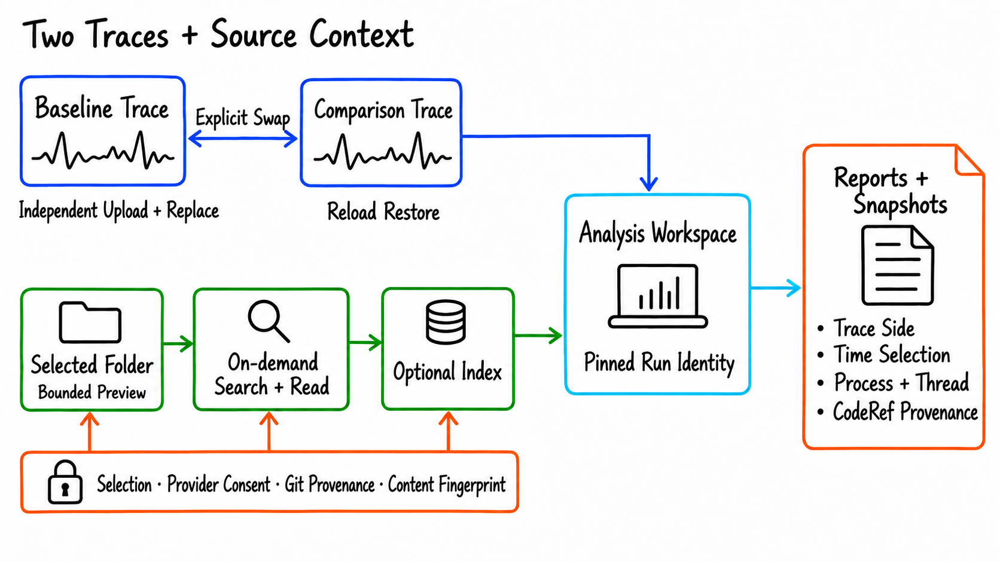
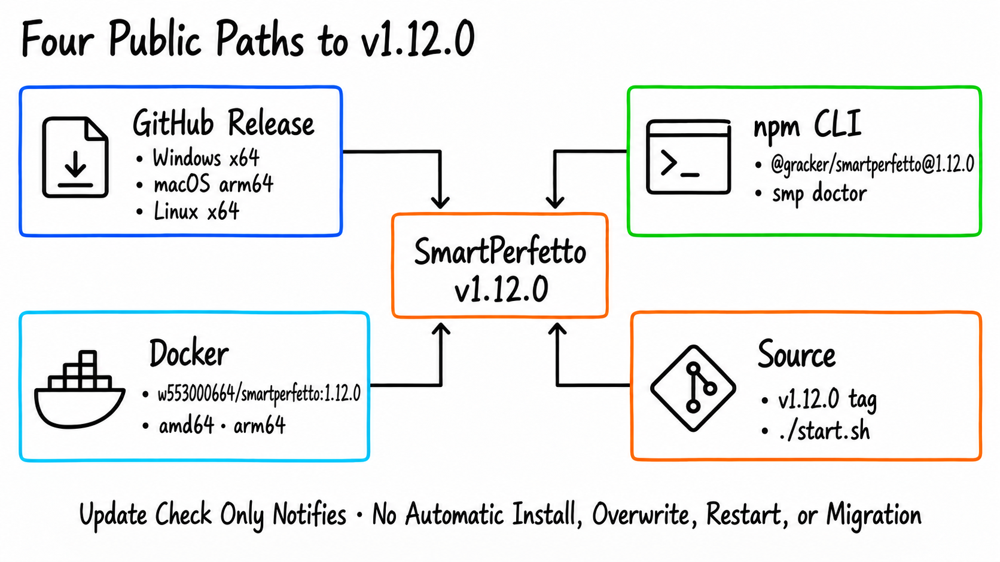

The [previous update](https://www.androidperformance.com/en/2026/08/21/SmartPerfetto-Five-Week-Update/) ended with v1.7.0 on August 21, 2026. From v1.7.0 on August 21 to v1.12.0 on September 17, SmartPerfetto shipped nine new versions and merged 141 non-merge commits across 28 calendar days.

The period added an arbitrary dual-Trace workspace, source analysis without a required prebuilt index, explicit Auto/Fast/Full modes, durable investigation checkpoints, and claim verification that reaches the Web UI, CLI, reports, and snapshots. Across these changes, a run now keeps the request, tool execution, evidence, claims, and delivery status available for inspection.

Project: [github.com/Gracker/SmartPerfetto](https://github.com/Gracker/SmartPerfetto).

<!--more-->

## Release range: v1.7.0 to v1.12.0

| Measure | Result |
| --- | --- |
| Date range | August 21 to September 17, 2026 |
| Public versions | 9: v1.8.0, v1.8.1, v1.8.2, v1.8.3, v1.8.4, v1.9.0, v1.10.0, v1.11.0, v1.12.0 |
| Non-merge commits | 141 |
| YAML Skills | 240 → 245 |
| Public distributions | GitHub portable packages, npm CLI, multi-architecture Docker image, and source checkout |

The nine releases form four groups. v1.8.x expanded Trace and source inputs. v1.9.0 made the analysis mode and turn intent explicit. v1.10.0 improved continuity for long investigations. v1.11.0 and v1.12.0 connected final answers to retained evidence and delivery diagnostics.

## 1. The dual-Trace workspace now accepts any two traces



The earlier comparison mode assumed a current Trace plus one historical reference Trace. v1.8.0 turned it into a fuller workspace. You can enter the split view before loading a Trace, upload or replace either pane independently, and then hand the pair to the main Viewer. Baseline and comparison roles stay stable, can be swapped explicitly, and survive a page reload with the layout.

Comparison continues to use one backend identity and evidence contract. Trace summaries, time selections, process and thread identities, and trace-processor capability versions are included in the receipt. Invalid inputs fail closed, and correlation evidence remains below causal claims.

The same release synchronized the bundled UI to Perfetto v58.2. The browser Viewer, native `trace_processor_shell`, SQL documentation, and indexes remain separately pinned. What the browser can display and which native processor produces AI/CLI evidence are related but distinct boundaries.

## 2. Source analysis no longer requires a complete index first

From v1.8.1 through v1.10.0, Code-Aware analysis received a broader input and authorization model. Before registration, the UI shows include and exclude scope. App, AOSP/OEM, and kernel trees can use bounded Git, ripgrep, or Node discovery. Files can be searched and read on demand; an index is an optional accelerator and semantic-retrieval layer.

Source authorization is not represented by a single consent flag. The current source selection, provider-send consent, active or pending index generation, Git provenance, and content fingerprint all participate in the run boundary. Scope expansion, consent changes, index replacement, or context drift during a run requires confirmation or causes rejection.

From v1.9.0, reports also retain how source was used: which registered folder participated, whether a reference came from on-demand access or an index, and which references were bound to the current Trace. v1.10.0 allowed authorized folders to participate without an active index, removing the need to build a database before reading a specific file.

## 3. Auto, Fast, and Full are explicit analysis modes

v1.9.0 exposed Auto, Fast, and Full in the AI Assistant and preserved that intent across follow-up turns.

- **Fast** answers facts that deterministic SQL or Skills can establish, avoiding an unnecessary model tool loop.
- **Full** permits planning, tool investigation, verification, and a complete report for startup, scrolling, ANR, comparison, or combined Trace-and-source work.
- **Auto** routes from the request and authorized context. A source-aware or verification-heavy question does not silently collapse into an incomplete direct answer.

The UI toggle sits on top of a runtime contract. The five runtimes—Claude, OpenAI, Pi, OpenCode, and Qoder—share typed turn intent, investigation requirements, and evidence context. Plans and report expansion follow the current request instead of a fixed scene template. Tool progress describes outcomes, such as a 42 ms main-thread wait. Row counts and serialized payloads are not presented as findings.

## 4. Long investigations can checkpoint and continue

Large traces, source-assisted investigations, and multi-turn provider calls can hit time limits, context limits, or transient network errors. v1.10.0 added durable investigation checkpoints. Hypotheses, collected evidence, parent-run identity, and pending work are stored with sessions, reports, and snapshots. A later turn can continue from those facts instead of repeating the completed investigation.

v1.11.0 added bounded extension and a delivery reserve to the OpenAI path. While tools continue to return data or the provider is still producing output, the run may extend within a hard cap. Near termination, one no-tool call is reserved to return a `partial` or `timeout` conclusion from the evidence already collected. The terminal state distinguishes a complete run, partial delivery, provider failure, and user cancellation.

Provider configuration became stricter as well. The Claude Agent SDK no longer treats a local Claude Code login as an implicit fallback. Without an API key, Bedrock, or Vertex configuration, it stops early and provides setup guidance. The CLI provider store and a source-started Web backend remain separate unless both explicitly use the same `SMARTPERFETTO_BACKEND_DATA_DIR`.

## 5. Final answers have an independent verification result

The main v1.11.0 change sits at final delivery. After a model produces a conclusion, SmartPerfetto binds its declared claims to retained tool execution captures and runs one bounded, no-tool semantic review. Each claim receives a `verified`, `partial`, `inference`, `unsupported`, or `not_checked` status. The overall verification result separately uses `passed`, `failed`, `partial`, or `not_checked`. The original conclusion body is preserved.

The verification result reaches every major output:

- The Web conversation remains readable while showing claim-level status and delivery diagnostics.
- The CLI uses `✓`, `~`, `!`, and `✗`, and emits `deliveryVerdict` in JSON/NDJSON `complete` events.
- HTML reports retain claims, evidence references, semantic-review results, and unchecked reasons.
- Snapshots and CLI turn artifacts retain the evidence bundle so later report export can inspect the original basis.

v1.12.0 filled in the failure details. Declaration problems, malformed relation-proposal fields, transport status, and attempt counts now appear as closed-vocabulary reason codes in the CLI, reports, persisted evidence, and the AI Assistant. The OpenAI semantic-review transport retries only connection errors, 408/425/429 responses, and 5xx failures. Deterministic 4xx responses and error-bearing 200 responses no longer repeat a doomed request.

The candidate answer, protocol validity, claim verification, and completed end-to-end run are four different outcomes. Collapsing them into one green icon loses useful information, so the post-v1.11.0 outputs keep them separate.

## 6. Scene methodology moved from fixed lists to evidence conditions

Startup and scrolling analysis changed in parallel. v1.11.0 added explicit startup investigation requirements for scheduling state, blocking, CPU frequency, main-thread state, and the selected startup window. Exact and rounded values are kept distinct.

v1.12.0 extended the same approach to scrolling backpressure. A deeper producer/consumer investigation is required only when evidence such as `render.frame.buffer_stuffing.rate` or `render.buffer.dequeue.wait.duration` shows buffer stuffing is dominant. A missing metric remains unknown; it is not treated as cleared.

The repository also gained 14 system-analysis E2E scenarios. Three real-Trace paths cover one startup Trace, one scrolling Trace, and a dual-Trace startup comparison. Eleven constructed scenarios cover scheduler, input, ANR, game, media, I/O, memory, power, Linux, network, and rendering-pipeline boundaries. Constructed traces prove synthetic event handling and system-evidence reads inside a selection; they do not stand in for real-device domain mechanisms or causal proof.

Batch execution gained `smp probe`. It loads the strategy registry from the exact artifact that the batch will run. A valid artifact prints `OK N`; an invalid one reports the `requirementId` and source file. A packaged parser that cannot understand a newer strategy schema is rejected before the batch starts, rather than failing every session after launch.

## 7. Distribution still has four public entry points



v1.12.0 is available through four public paths:

| Entry point | Current state |
| --- | --- |
| GitHub Release | Portable packages for Windows x64, macOS arm64, and Linux x64 |
| npm | `@gracker/smartperfetto@1.12.0` |
| Docker | `w553000664/smartperfetto:1.12.0` for linux/amd64 and linux/arm64 |
| Source | The `v1.12.0` tag; `./start.sh` remains the default entry point |

The in-app update check is notification-only. It does not replace packages, modify a source checkout, restart containers, or migrate user data. Docker stable uses immutable version tags, and portable-package updates do not overwrite an existing install or user-data directory.

After installing or updating the CLI, run the environment checks:

```bash
npm install -g @gracker/smartperfetto@1.12.0
smp doctor
smp update check
```

For a pinned Docker deployment, set the Compose tag to `1.12.0`, then pull and recreate the service:

```bash
docker compose -f docker-compose.hub.yml pull
docker compose -f docker-compose.hub.yml up -d
```

## 8. Boundaries that still matter

Strict verification exposes problems that were previously easy to miss. The v1.11.0 release notes record a known issue that v1.12.0 does not list as fixed: long startup and scrolling reports from real providers are often marked `partial` when rounded values lack an approximation marker or answer assertions have no matching declaration. The answer is still delivered and the failing checks are shown. `partial` describes an incomplete delivery-quality result; it does not mean the Trace analysis process crashed.

Evidence tiers are another boundary. A constructed Trace can validate a query, identity, selection, and report protocol. It cannot replace real-device GPU, I/O, energy, or vendor Camera data. Correlation also cannot be promoted directly to causation. SmartPerfetto separates missing evidence, an unchecked claim, and a failed check, but the final result still depends on whether the input Trace contains the necessary data sources.

## Work on main after v1.12.0

The current main branch contains a small set of changes that have not entered a new release: the HTTP 507 disk-precheck message is more actionable; startup analysis resolves main-thread wakeup chains and sleep attribution; hypotheses can be re-resolved while keeping superseded history; and the prompt budget is larger so additional methodology rules are not truncated.

These changes are unreleased main-branch work and are not part of the public v1.12.0 contract. They can enter the release-note series after the next version is published.

## Version timeline

| Version | Date | Main change |
| --- | --- | --- |
| v1.8.0 | 2026-08-25 | Arbitrary dual-Trace workspace, Perfetto v58.2, trace-processor capability attribution, and evaluation foundations |
| v1.8.1 | 2026-08-26 | Codebase preview, registration, search, and reading without a required prebuilt index; authorization and index lifecycle |
| v1.8.2 | 2026-08-26 | Source traversal `time_budget` semantics |
| v1.8.3 | 2026-08-27 | Source-scope expansion confirmation, npm Trusted Publishing, and retrieval-boundary fixes |
| v1.8.4 | 2026-08-27 | Repository metadata required by npm Sigstore provenance |
| v1.9.0 | 2026-09-08 | Auto/Fast/Full, typed turn intent, tool narration, and evidence retention across outputs |
| v1.10.0 | 2026-09-11 | Investigation checkpoints, session recovery, main-thread scheduling evidence, and on-demand source analysis |
| v1.11.0 | 2026-09-16 | Claim verification, semantic review, CLI delivery markers, bounded extension, and partial delivery |
| v1.12.0 | 2026-09-17 | Conditional investigation requirements, `smp probe`, Trace lease upgrade, and failure reason codes |

## Links

- [SmartPerfetto on GitHub](https://github.com/Gracker/SmartPerfetto)
- [v1.12.0 Release](https://github.com/Gracker/SmartPerfetto/releases/tag/v1.12.0)
- [Quick Start](https://github.com/Gracker/SmartPerfetto/blob/main/docs/getting-started/quick-start.en.md)
- [Application Updates](https://github.com/Gracker/SmartPerfetto/blob/main/docs/getting-started/application-updates.en.md)
- [Code-Aware Analysis](https://github.com/Gracker/SmartPerfetto/blob/main/docs/getting-started/code-aware-analysis.en.md)
- [Agent Runtime Architecture](https://github.com/Gracker/SmartPerfetto/blob/main/docs/architecture/agent-runtime.en.md)
