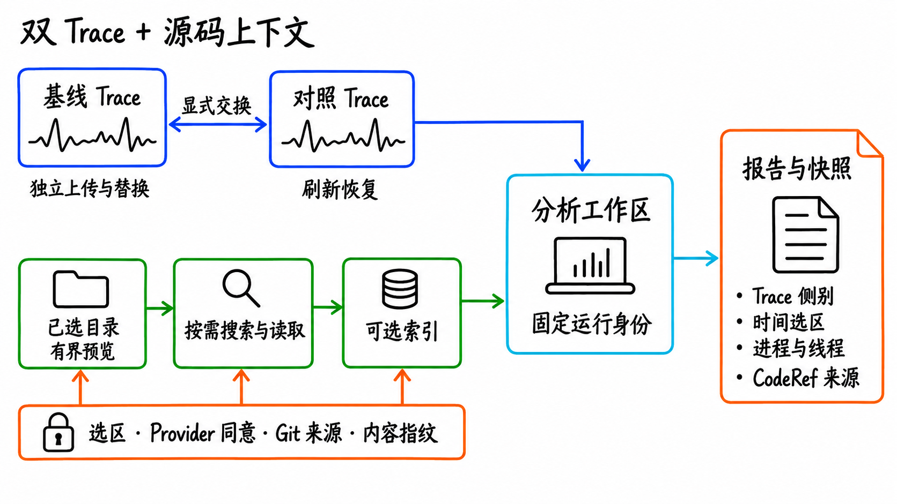
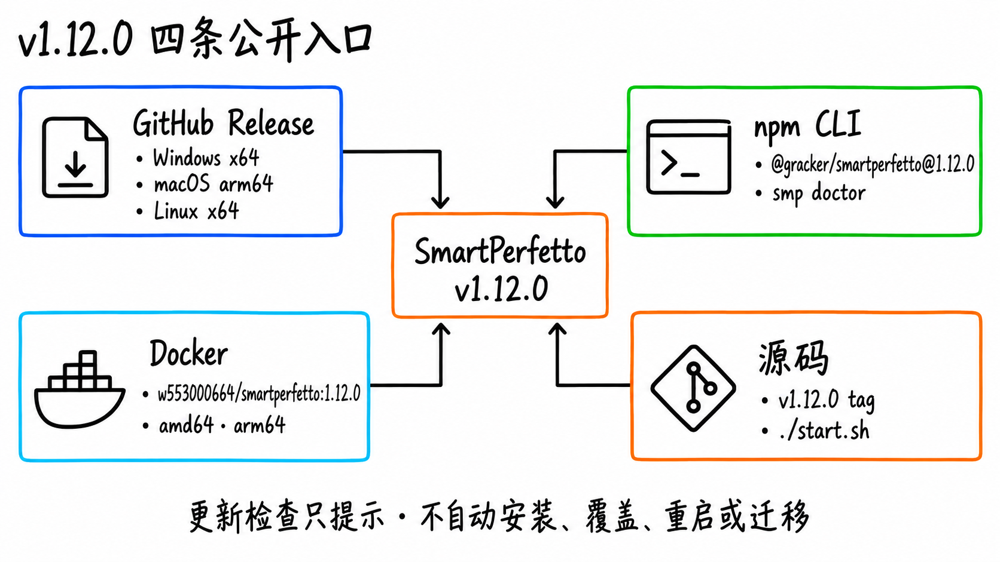

[上一篇更新](https://www.androidperformance.com/2026/08/21/SmartPerfetto-Five-Week-Update/)写到 2026 年 8 月 21 日的 v1.7.0。从 8 月 21 日的 v1.7.0 到 9 月 17 日的 v1.12.0，这 28 个日历日内，SmartPerfetto 发布了 9 个新版本，仓库合入 141 个非 merge 提交。

这段时间增加了任意双 Trace 工作台、无需预建索引的源码分析、Auto/Fast/Full 显式模式、跨会话调查检查点，以及贯穿 Web、CLI、报告和快照的结论核验。变化很多，但方向很集中：让一次分析从「模型给出答案」变成「请求、工具执行、证据、断言和最终交付都能核对」。

项目地址：[github.com/Gracker/SmartPerfetto](https://github.com/Gracker/SmartPerfetto)。

<!--more-->

## 版本跨度：v1.7.0 到 v1.12.0

| 口径 | 结果 |
| --- | --- |
| 时间范围 | 2026-08-21 至 2026-09-17 |
| 公开版本 | 9 个：v1.8.0、v1.8.1、v1.8.2、v1.8.3、v1.8.4、v1.9.0、v1.10.0、v1.11.0、v1.12.0 |
| 非 merge 提交 | 141 个 |
| YAML Skill | 240 → 245 |
| 当前公开分发 | GitHub 三平台免安装包、npm CLI、Docker 多架构镜像、源码运行 |

这 9 个版本可以分成四条线：v1.8.x 扩展 Trace 与源码输入；v1.9.0 明确分析模式和请求意图；v1.10.0 处理长任务的连续性；v1.11.0 和 v1.12.0 把最终答案接到证据核验和交付诊断上。

## 1. 双 Trace 工作台支持任意两条 Trace



早期双窗模式依赖「当前 Trace + 历史参考 Trace」。v1.8.0 改成了更完整的工作台：没有打开 Trace 时也能直接进入双窗，两个窗格分别上传或替换文件，再把这对 Trace 交给主 Viewer。基线与对照的身份保持稳定，也可以显式交换；页面刷新后，Trace 配对和布局会恢复。

比较结果继续使用同一套后端身份和证据契约。Trace 摘要、时间选区、进程与线程归属、trace processor 能力版本都会进入分析回执。相关输入无效时直接拒绝，相关性证据也不会被提升为因果结论。

这一版同时同步到 Perfetto v58.2，浏览器 Viewer、原生 `trace_processor_shell`、SQL 文档和索引按各自的固定版本运行。浏览器时间线能展示什么，与 AI/CLI 用哪一个原生处理器取证，仍然是两条明确边界。

## 2. 源码分析不再要求先建完整索引

v1.8.1 到 v1.10.0 连续补齐了 Code-Aware 的输入和授权流程。注册代码库前，界面会显示包含与排除范围；App、AOSP/OEM 和 Kernel 目录都可以使用有界的 Git、ripgrep 或 Node 扫描。源码文件可按需搜索和读取，索引成为可选的加速与语义检索能力。

源码上下文不会只靠一个「已同意」开关。当前 source selection、Provider 发送同意、活动或待定索引代际、Git 来源和内容指纹共同决定一次运行能否继续。选区扩大、同意状态变化、索引替换或运行中的上下文漂移都会触发确认或拒绝。

从 v1.9.0 开始，源码使用来源也进入报告：分析使用了哪个注册目录、通过按需读取还是索引命中、哪些引用绑定到当前 Trace，都可以在后续报告和审计里回看。v1.10.0 又允许已授权目录在没有活动索引时按需参与分析，减少「先等建库，才能查一行代码」的阻塞。

## 3. Auto、Fast、Full 成为显式分析模式

v1.9.0 把 Auto、Fast、Full 放到 AI Assistant 里，后续提问也保留本轮的模式意图。

- **Fast**：面向可由确定性 SQL/Skill 回答的事实问题，减少不必要的模型工具循环。
- **Full**：允许计划、工具调查、验证和完整报告，适合启动、滑动、ANR、对比和源码联合分析。
- **Auto**：根据请求语义和已授权上下文选择路径；涉及源码、复杂场景或必须核验的要求时，不会静默退化成残缺直答。

界面开关下面还有运行时契约。五条运行时——Claude、OpenAI、Pi、OpenCode、Qoder——共享带类型的 turn intent、调查要求和证据上下文。计划和报告按用户本轮请求展开，不再由固定场景模板提前决定所有章节。工具进度会叙述结果，例如「定位到一次 42 ms 主线程等待」；SQL 行数和序列化 payload 不会被当作发现。

## 4. 长任务可以保存调查检查点并继续

长 Trace、源码联合分析和多轮 Provider 调用容易碰到超时、上下文上限或临时网络错误。v1.10.0 引入持久化调查检查点：已经形成的假设、取到的证据、父运行身份和后续待查项会保存在会话、报告与快照里。后续提问可以沿用这些状态，不必把前一轮重新跑一遍。

v1.11.0 又给 OpenAI 路径增加了有界延期和交付预留。工具持续返回数据或 Provider 仍在输出时，运行可以在硬上限内延长；接近终止时保留一次不调用工具的交付机会，用已经取得的证据返回 `partial` 或 `timeout` 结论。最终状态会说明是完整结束、部分交付、Provider 失败还是用户停止。

Provider 配置边界也更清楚。Claude Agent SDK 不再读取本机 Claude Code 登录作为隐式后备；没有 API key、Bedrock 或 Vertex 配置时会提前停止并给出设置入口。CLI Provider 存储与源码启动的 Web 后端默认独立，只有两边显式使用同一个 `SMARTPERFETTO_BACKEND_DATA_DIR` 才共享数据。

## 5. 最终答案现在有独立的证据核验结果

v1.11.0 的主要变化发生在最终交付边界。模型生成结论后，SmartPerfetto 会把结论声明与本轮保留的工具执行证据绑定，再做一次有界、禁用工具的语义复核。每条声明会得到 `verified`、`partial`、`inference`、`unsupported` 或 `not_checked` 状态；整轮核验另有 `passed`、`failed`、`partial` 和 `not_checked` 结果。原始结论正文仍然保留。

核验结果会投影到所有主要输出：

- Web 对话保持可读，同时显示结论级核验状态和交付诊断；
- CLI 使用 `✓`、`~`、`!`、`✗` 标记，并在 JSON/NDJSON `complete` 事件里输出 `deliveryVerdict`；
- HTML 报告保留声明、证据引用、语义复核和未核验原因；
- 快照和 CLI turn artifact 保存证据包，后续导出报告仍能复查原始依据。

v1.12.0 补齐了诊断细节。声明格式问题、关系提案字段错误、传输状态和尝试次数会使用固定原因码显示在 CLI、报告、持久化证据和前端里。OpenAI 语义复核只重试连接错误、408/425/429 和 5xx；确定性的 4xx 或带错误内容的 200 响应不会重复发送同一个失败请求。

候选答案、协议是否有效、声明核验和整轮 E2E 是否完成，是四个不同结果。文章、日志或 UI 只显示一个绿色图标会丢掉这些差异，因此 v1.11.0 之后的输出会把它们分开。

## 6. 场景方法从固定清单变成证据条件

启动和滑动分析这轮也在变化。v1.11.0 为启动分析增加显式调查要求：调度状态、阻塞、CPU 频率、主线程状态和启动窗口需要用对应证据回答，精确值与近似值也要区分。

v1.12.0 把同样的原则扩展到滑动背压。只有 `render.frame.buffer_stuffing.rate` 或 `render.buffer.dequeue.wait.duration` 等证据显示 buffer stuffing 占主导时，系统才要求进一步调查 Render/GPU/Buffer 生产者与消费者边界。指标缺失保持 unknown，不会被当成「已经排除」。

仓库同时增加了 14 个系统分析 E2E 场景：3 个真实 Trace 路径覆盖单 Trace 启动、单 Trace 滑动和双 Trace 启动对比；11 个构造场景覆盖 scheduler、input、ANR、game、media、IO、memory、power、Linux、network 和 rendering pipeline。构造 Trace 只证明合成事件与选区内的系统证据读取，不冒充真机领域机制或因果证明。

批量运行新增 `smp probe`。它会用批任务将要使用的同一份 artifact 加载策略注册表，成功时输出 `OK N`，失败时给出带 `requirementId` 和源文件的错误。打包产物如果还不认识新的策略 schema，可以在批量任务启动前被拦住。

## 7. 分发与更新仍然保持四条入口



v1.12.0 已经可以从四条公开入口获得：

| 入口 | 当前状态 |
| --- | --- |
| GitHub Release | Windows x64、macOS arm64、Linux x64 三个免安装包 |
| npm | `@gracker/smartperfetto@1.12.0` |
| Docker | `w553000664/smartperfetto:1.12.0`，linux/amd64 与 linux/arm64 |
| 源码 | `v1.12.0` tag；默认入口仍是 `./start.sh` |

应用内更新检查只负责提示，不会自动替换包、修改源码 checkout、重启容器或迁移用户数据。Docker stable 使用不可变版本 tag；免安装包更新也不会覆盖现有安装目录和用户数据目录。

CLI 安装或更新后可以先检查运行环境：

```bash
npm install -g @gracker/smartperfetto@1.12.0
smp doctor
smp update check
```

Docker 使用固定版本时，把 Compose 文件里的 tag 设为 `1.12.0`，再执行 pull 和重建：

```bash
docker compose -f docker-compose.hub.yml pull
docker compose -f docker-compose.hub.yml up -d
```

## 8. 仍需知道的边界

严格核验会暴露以前容易被忽略的问题。v1.11.0 发布说明记录了一项已知问题，v1.12.0 没有把它列为已修复：真实 Provider 运行长启动或滑动报告时，近似数值没有标记、正文断言没有对应声明，都会让语义复核把结果标成 `partial`。答案仍然交付，失败项也会显示；`partial` 表示交付质量没有全部通过，不等于 Trace 分析进程崩溃。

另一个边界是证据层级。构造 Trace 能验证查询、身份、选区和报告协议，不能替代真机 GPU、IO、能耗或厂商 Camera 数据。相关性也不能直接写成因果关系。SmartPerfetto 会尽量把「没有证据」「没有检查」「检查失败」分开，但最终结论仍取决于输入 Trace 是否包含对应数据源。

## v1.12.0 之后的主分支进展

当前主分支已经包含少量尚未进入新版本的改动：磁盘预检的 HTTP 507 提示改得更可执行；启动场景增加主线程 wakeup chain 与 sleep attribution；假设允许保留 superseded 历史后重新求解；提示词预算提高，避免新增方法论规则被截断。

这些内容属于未发布主分支，不计入 v1.12.0 的公开发布说明。后续版本发布时再进入正式更新标题和时间线。

## 版本时间线

| 版本 | 日期 | 主要变化 |
| --- | --- | --- |
| v1.8.0 | 2026-08-25 | 任意双 Trace 工作台、Perfetto v58.2、trace processor 能力归属与评估基础 |
| v1.8.1 | 2026-08-26 | 无需预建索引的代码库预览、注册、搜索与读取；授权和索引生命周期 |
| v1.8.2 | 2026-08-26 | 源码遍历 `time_budget` 语义修复 |
| v1.8.3 | 2026-08-27 | 源码选区扩大确认、npm Trusted Publishing、检索边界修复 |
| v1.8.4 | 2026-08-27 | npm Sigstore provenance 所需仓库元数据 |
| v1.9.0 | 2026-09-08 | Auto/Fast/Full、typed turn intent、工具叙述、跨输出证据保留 |
| v1.10.0 | 2026-09-11 | 调查检查点、会话恢复、主线程调度证据、按需源码分析 |
| v1.11.0 | 2026-09-16 | 结论核验、语义复核、CLI 交付标记、有界延期与部分交付 |
| v1.12.0 | 2026-09-17 | 条件化调查要求、`smp probe`、Trace lease 升级和失败原因码 |

## 相关链接

- [SmartPerfetto GitHub](https://github.com/Gracker/SmartPerfetto)
- [v1.12.0 Release](https://github.com/Gracker/SmartPerfetto/releases/tag/v1.12.0)
- [快速开始](https://github.com/Gracker/SmartPerfetto/blob/main/docs/getting-started/quick-start.md)
- [应用更新](https://github.com/Gracker/SmartPerfetto/blob/main/docs/getting-started/application-updates.md)
- [Code-Aware 分析](https://github.com/Gracker/SmartPerfetto/blob/main/docs/getting-started/code-aware-analysis.md)
- [Agent Runtime 架构](https://github.com/Gracker/SmartPerfetto/blob/main/docs/architecture/agent-runtime.md)
